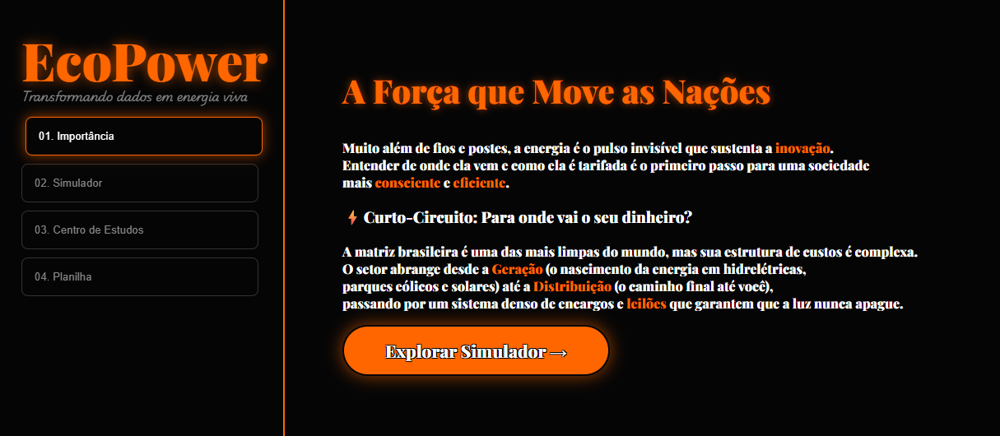
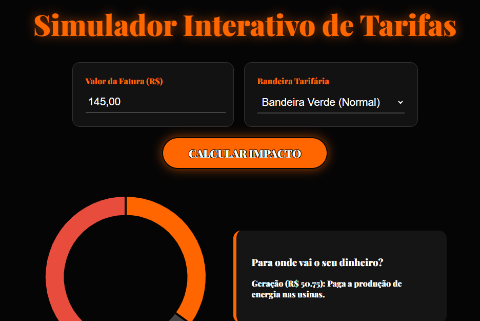
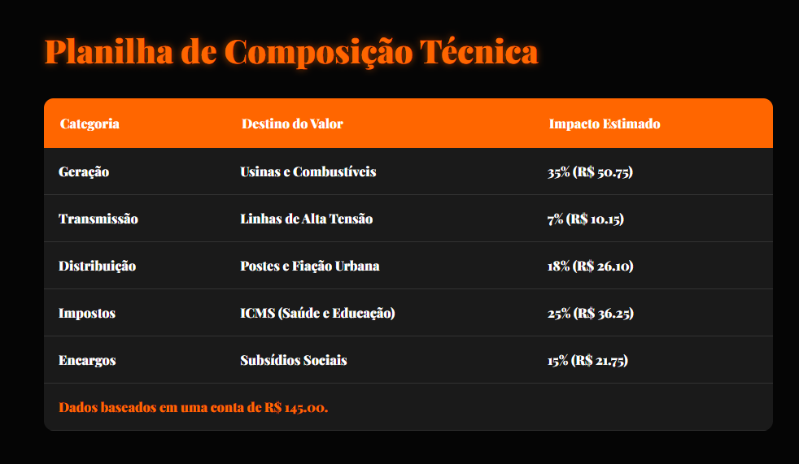

# ⚡ EcoPower - Simulador de Impacto Energético

> "Entender a eletricidade é o primeiro passo para dominar a força que move as nações."

---

## 📸 O Projeto em Detalhes

Confira abaixo o visual do simulador (Glow UI / Neon Design):

  
    
  
    
  

---

## 👋 Um Convite Especial

Seja muito bem-vindo(a) ao meu projeto de conclusão da trilha Explorer! 🚀

Eu te convido a explorar esta ferramenta que vai além de um simples código. Aqui, eu busquei unir a lógica do **desenvolvimento web** com os fundamentos complexos da **economia energética**. Se você já se perguntou para onde vai cada centavo da sua conta de luz, este simulador foi feito para você. 

Sinta-se à vontade para interagir, testar valores e aprender um pouco mais sobre como o Brasil se mantém iluminado.

[**👉 CLIQUE AQUI PARA ACESSAR O SIMULADOR AO VIVO**](http://lailaamorim.github.io/EcoPower/)

---

## 📑 O que o EcoPower oferece?

O projeto está estruturado em quatro pilares educativos:
1. **Narrativa de Importância:** A energia como espinha dorsal da sociedade.
2. **Simulador Interativo:** Gráficos sincronizados que explicam Geração, Rede e Impostos.
3. **Planilha Técnica:** Detalhamento de encargos (TUSD/TE) inspirado em dados do setor.
4. **Trilha de Estudos Master:** Conceitos de gestão pública, leilões e planejamento.

---

## 🧠 Conhecimentos Adquiridos (Resumo Técnico)

Durante este desenvolvimento, mergulhei em tópicos fundamentais do setor elétrico:

- **EPE & PDE:** Planejamento e estratégia para os próximos 10 anos.
- **BEN (Balanço Energético Nacional):** Auditoria e histórico da nossa matriz energética.
- **Hidro vs. Solar:** O conceito de "Bateria Natural" e a complementariedade de fontes.
- **Mercado de Leilões:** A diferença entre Energia Nova (investimento) e Existente (estabilidade de preço).
- **SIN (Sistema Interligado Nacional):** A grande rede que conecta o país de Norte a Sul.

---

## 🛠️ Tecnologias

- **HTML5 & CSS3** (Custom Glow Design / Neon)
- **JavaScript ES6+** (Cálculos dinâmicos e Manipulação de DOM)
- **Chart.js** (Gráficos interativos com sincronia de mouse)
- **Git & GitHub** (Versionamento e Deploy)

---

## ✨ Finalização e Inspiração

Este projeto marca o fim de uma jornada intensa de aprendizado. Ele foi inspirado por uma colega estudante de **Economia**, que me despertou a curiosidade de entender a estrutura por trás da "luz". 

Concluir o **EcoPower** significa para mim a capacidade de transformar dados técnicos complexos em uma interface amigável, funcional e educativa. É a tecnologia servindo à transparência e ao conhecimento.

---

## 📩 Contato

📧 [lailaamorimsant@gmail.com](mailto:lailaamorimsant@gmail.com)  
🚀 [Meu GitHub](https://github.com/LailaAmorim) 
💼 [LinkedIn](https://www.linkedin.com/in/laila-amorim-82542a20b)

---

Feito com ❤️ por Laila Amorim 

